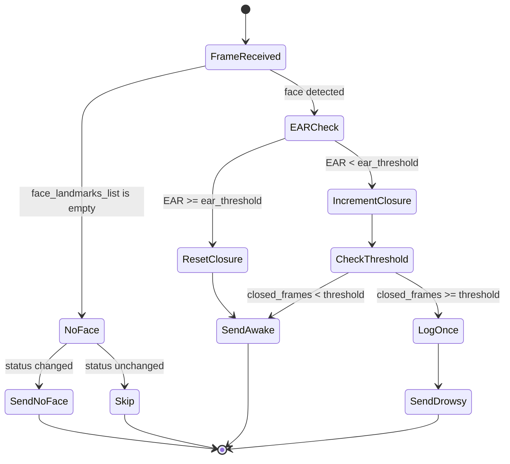

# Main Loop (`earsys.loop`)

The `earsys.loop` module contains the central detection workflow. `run_detection` is the single function that orchestrates frame acquisition, inference, state tracking, UDS dispatch, and the Rich live dashboard.

## `run_detection()`

```python
def run_detection(
    camera: OpenCvCamera,
    detector: FaceDetector,
    bridge: UdsBridge | None,
    console: Console | None = None,
) -> bool:
```

Runs until the camera stream ends, fails, or the user requests a shutdown.

**Returns** `True` when shutdown was user-initiated (keyboard interrupt or ESC in the dev window), `False` when the camera stream ended or failed.

The caller (`cli._run_with_retries`) uses the return value to decide whether to reopen the camera or exit.

---

## Detection State Machine

Each frame passes through the following states:



`DrowsinessState.reset_eye_closure()` sets `closed_frames = 0` and clears the `drowsy_logged` flag.

The `drowsy_logged` flag prevents the drowsiness warning from being emitted on every frame — it is logged exactly once per consecutive closure event.

---

## Internal Data Structures

### `DrowsinessState`

Tracks the rolling eye-closure state across frames.

| Field | Type | Description |
|-------|------|-------------|
| `closed_frames` | `int` | Consecutive frames where EAR was below `ear_threshold`. |
| `drowsy_logged` | `bool` | Whether the drowsiness warning has already been emitted for this event. |
| `previous_status` | `int \| None` | Last emitted status code; used to suppress redundant `NO_FACE` packets. |

### `DetectionStats`

Cumulative counters shown in the live dashboard.

| Field | Description |
|-------|-------------|
| `frames_total` | Total frames read from the camera. |
| `sent_awake` | Frames dispatched with `STATUS_AWAKE`. |
| `sent_drowsy` | Frames dispatched with `STATUS_DROWSY`. |
| `sent_no_face` | State transitions dispatched with `STATUS_NO_FACE`. |
| `frame_errors` | Frames where an exception was caught and suppressed. |
| `sent_fused_scores` | Total `bridge.send()` calls (all statuses combined). |

---

## Live Dashboard

The Rich `Live` context wraps the entire loop. A `Panel` containing a 4-column `Table` is refreshed at up to 4 FPS (every 250 ms), showing:

- Current status (AWAKE / DROWSY / NO FACE) with color coding
- EAR value and uptime
- Closed-frames counter and total fused packets sent
- Error counter and per-status UDS packet breakdown

---

## Color Format Handling

Before passing a frame to MediaPipe, `_to_rgb_frame()` converts it from the camera's native format to RGB:

| Camera `color_format` | Conversion |
|-----------------------|-----------|
| `"rgb"` | Pass through (no conversion) |
| `"nv12"` | `cv2.COLOR_YUV2RGB_NV12` |
| `"bgr"` (default) | `cv2.COLOR_BGR2RGB` |

MediaPipe's `FaceLandmarker` requires `SRGB` (RGB) input.

---

## Dev Visualization

When `feature_visualize_landmarks` is enabled, `show_debug_frame()` (from `earsys.vision.draw`) is called after every successfully processed frame. If it returns `True` (user pressed ESC), `cv2.destroyAllWindows()` is called and the loop returns `True`.
